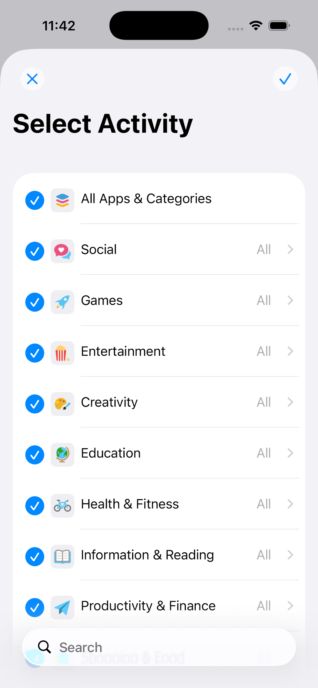
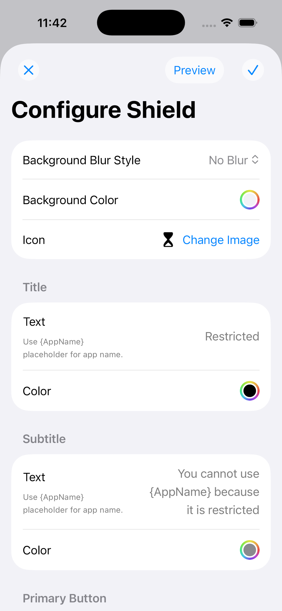
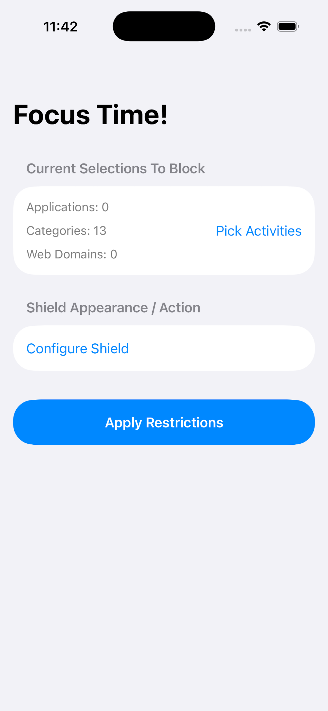

#  SwiftUI/iOS: My Block My Choice

A screen time app that allows the user to design their own blocking shield,
aiming at helping the user to focus.

## Basic Functionalities

This app allows the user to

- Select apps, web domains, and other activities to apply the shield to
- Customize the shield appearance
- Control the shield button behavior
- Apply and remove the shield

  
  
  

## Permission Required

| Category        | Permission                                                             |
| :-------------- | :--------------------------------------------------------------------- |
| Family Controls | Requests authorization to provide parental controls for an individual. |

## License

[License](./LICENSE.md)

## Privacy Policy

[Privacy Policy](./privacy.html)

## Support

If you need any help on the app, please open an issue or contact me at
[itsuki.enjoy@gmail.com](itsuki.enjoy@gmail.com).
